# 👋 Hi, I'm Davi Epifânio Maia!

### Software Engineer · Full Stack Developer · Software Architecture

I'm a Brazilian Software Engineer passionate about technology, software architecture and building solutions that solve real-world problems.

I work across the entire software development lifecycle — from designing architectures and APIs to building scalable applications, databases and CI/CD pipelines.

[](https://www.linkedin.com/in/davi-epif%C3%A2nio-75158b191/)
[](mailto:daviepifaniomaia@gmail.com)

---

## 👨‍💻 Who Am I?

```ts
const davi = {
  name: "Davi Epifânio Maia",
  age: 29,
  location: "Brazil 🇧🇷",

  education: {
    degree: "Systems Analysis and Development",
    postGraduation: [
      "Software Architecture",
      "Software Engineering"
    ]
  },

  role: "Software Engineer",

  focus: [
    "Software Architecture",
    "Backend Development",
    "Full Stack Development",
    "API Design",
    "Clean Code",
    "Scalable Systems",
    "DevOps",
    "AI-assisted Development"
  ]
};
```

---

## 🛠️ Tech Stack

### 💻 Languages


### 🎨 Frontend


### ⚙️ Backend


### 🗄️ Databases


### ☁️ DevOps & Tools


---

## 🏗️ Architecture & Engineering

I enjoy designing software that is maintainable, scalable and easy to evolve.

* 🧩 Modular Monolith
* 🏛️ Clean Architecture
* 🔗 REST APIs
* 🧱 MVC
* 🔌 Microservices
* ☁️ Serverless
* 📦 SPA
* 🔄 Event-Driven Architecture
* 🎯 SOLID
* 🧠 Design Patterns
* 🗂️ Domain-Driven Design

---

## 📊 GitHub Stats

<p align="center">
  
  
</p>

---

## 🐍 My Contributions

<p align="center">
  <picture>
    <source
      media="(prefers-color-scheme: dark)"
      srcset="https://raw.githubusercontent.com/EpifanioD/EpifanioD/output/github-snake-dark.svg"
    />
    <source
      media="(prefers-color-scheme: light)"
      srcset="https://raw.githubusercontent.com/EpifanioD/EpifanioD/output/github-snake.svg"
    />
    
  </picture>
</p>

---

## 📈 Contribution Activity

[](https://github.com/EpifanioD)

---

## 🚀 Current Focus

* 🏗️ Designing scalable software architectures
* 🚀 Building personal and professional projects
* 🤖 Exploring AI-assisted software development
* 🔌 Exploring AI integrations and MCP
* ☁️ Improving cloud and DevOps practices
* 🧠 Continuously improving system design skills
* 📚 Learning and experimenting with new technologies

---

## 💭 Philosophy

> **"Good software is not just code that works.
> It's code that can evolve."**

---

<p align="center">
  <i>Thanks for visiting my profile! 🚀</i>
</p>
