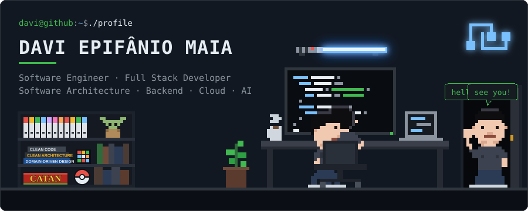
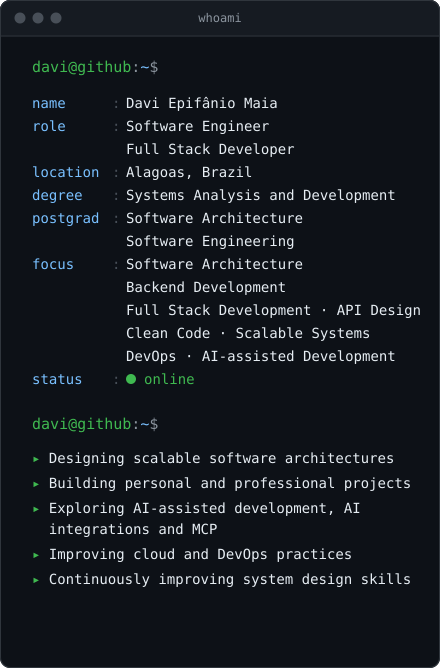
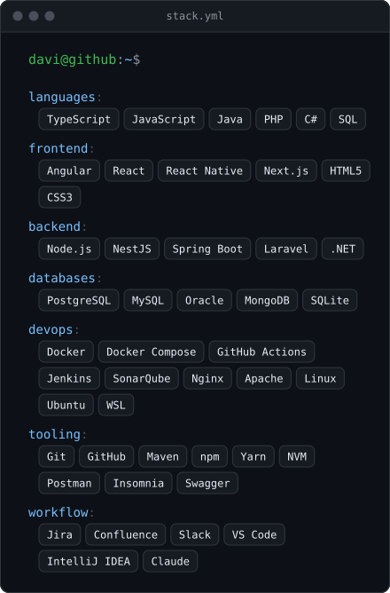
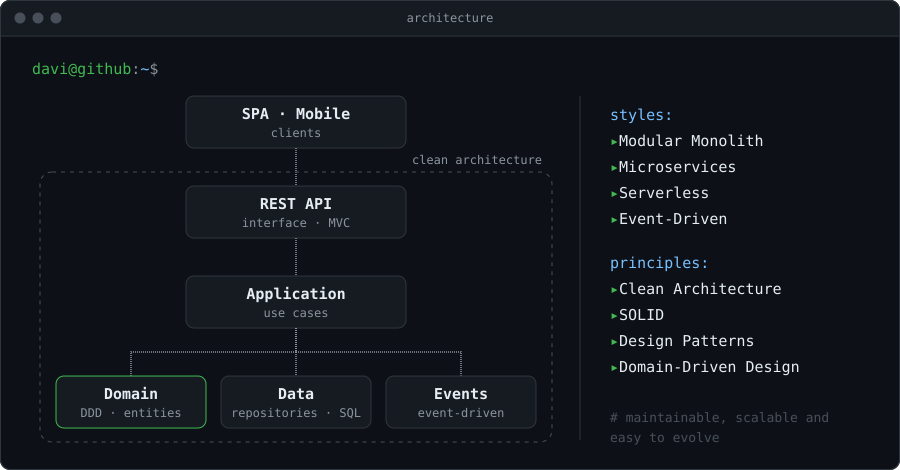
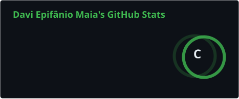
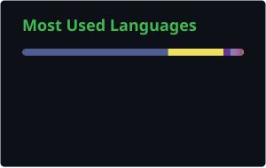

  

  
  
  

  
  

  

<code>davi@github:~$ ./snake --eat-contributions</code>

  <picture>
    <source media="(prefers-color-scheme: dark)" srcset="https://raw.githubusercontent.com/EpifanioD/EpifanioD/output/github-snake-dark.svg" />
    <source media="(prefers-color-scheme: light)" srcset="https://raw.githubusercontent.com/EpifanioD/EpifanioD/output/github-snake.svg" />
    
  </picture>

<i>"Good software is not just code that works. It's code that can evolve."</i>

<code>davi@github:~$ ls ./extras</code>

 

  
  

  This profile is generated by code: Python renders the SVGs in <a href="./scripts">scripts/</a> and GitHub Actions refreshes them daily.

